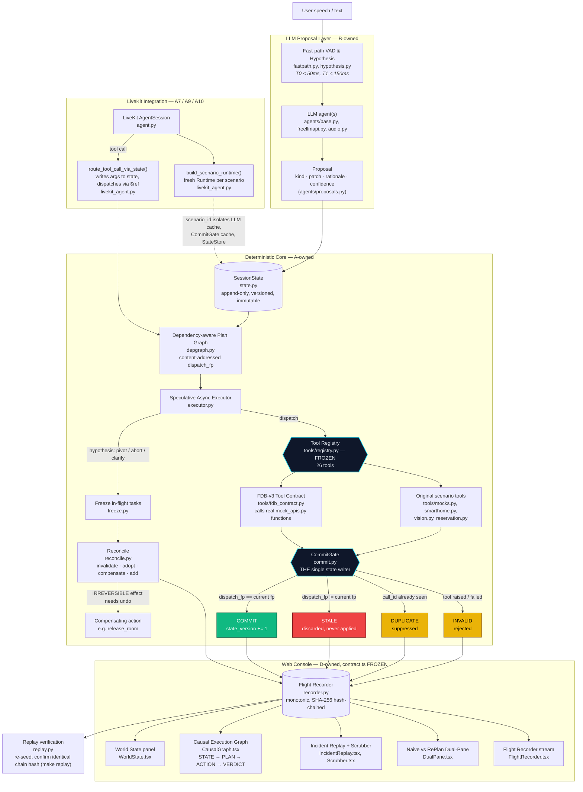

# RePlan: A Deterministic Commit Gate for Interruptible Real-Time Agents

> **Samsung PRISM GenAI Hackathon 2026 · Theme 05 — Interruptible Real-Time Agents**
> Built and benchmarked against **Full-Duplex-Bench v3** (LiveKit-based real-time tool-calling benchmark).

---

## 1. Executive Summary

Voice agents that use tools fail in one specific, well-documented way: the user changes their mind mid-task ("actually, make that Mumbai"), but a tool call dispatched *before* the correction is still in flight. When that stale result lands, most systems either silently commit it (corrupting state) or the underlying model just gets confused. In the Full-Duplex-Bench v3 research this project targets, **self-correction is the single worst-scoring category across every system tested** — better architectures haven't fixed it because it isn't a model problem, it's a state-management problem.

**RePlan is the state-management fix.** It's a deterministic runtime that sits between an LLM's tool-call proposals and their effects. Every dispatched tool call carries a **content-addressed fingerprint** of the state it was computed against. A result only commits if that fingerprint still matches the runtime's *current* state at the moment the result arrives. If the user corrected mid-flight, the fingerprint no longer matches — the result is rejected as `STALE`, never applied, never spoken back to the user. This is enforced structurally by a single writer (`CommitGate`), not by prompting the model to "be careful."

---

## 2. What's Actually Novel Here

This is **not** a better prompt, a bigger model, or a retry loop. The claim is narrower and more falsifiable:

- **Fingerprint validity is a total function of (tool, resolved arguments, state version) — never of wall-clock arrival order.** A result that arrives late is rejected *because* the world changed underneath it, not because it arrived after some timeout.
- **Single writer.** Only `CommitGate` ever mutates committed state (`replan/commit.py`, under 60 lines). No tool, no agent, no speculative branch can write state directly — enforced as a banned pattern, checked by CI (`make check`).
- **Effect safety.** `IRREVERSIBLE` tools are structurally barred from speculative dispatch — the executor won't even attempt them until their inputs are confirmed, not just "likely."
- **Causal completeness, not just correctness.** Every committed state version names the exact event and result that produced it — the whole decision history replays byte-for-bit identically from a recorded event log (`make replay` verifies this against a re-seeded run).
- **This is independently falsifiable**, not a claim you have to take our word for: we benchmarked the exact failure mode against FDB-v3 (below), and the architecture itself is provable live in under two seconds with no canned data (see §6).

---

## 3. Architecture

```
USER SPEECH / TEXT
  ↓
FAST-PATH VAD & HYPOTHESIS         (replan/fastpath.py, replan/hypothesis.py)
  ↓
LLM PROPOSAL                        (replan/agents/*) → Proposal objects only, never a direct state write
  ↓
VERSIONED STATE STORE               (replan/state.py) — append-only, every version immutable
  ↓
DEPENDENCY-AWARE PLAN GRAPH         (replan/depgraph.py) — content-addressed dispatch fingerprints
  ↓
SPECULATIVE ASYNC EXECUTOR          (replan/executor.py, replan/freeze.py) — dispatches, freezes on hypothesis
  ↓
TRANSACTIONAL COMMIT GATE           (replan/commit.py) — THE single state writer
  ├── COMMIT     → fingerprint matches current state, version incremented
  ├── STALE      → fingerprint mismatch (dispatched at vN, now vM) — discarded
  ├── DUPLICATE  → call_id already adjudicated — suppressed
  └── INVALID    → tool execution failure — rejected
  ↓
RECONCILE + COMPENSATE              (replan/reconcile.py) — invalidate/adopt/compensate on correction
  ↓
FLIGHT RECORDER                     (replan/recorder.py) — monotonic, SHA-256 hash-chained event ledger
  ↓
LIVEKIT ADAPTER                     (replan/livekit_agent.py) — routes a LiveKit session's turns/tool-calls
  through this same pipeline; agent.py wires it into a live voice session
  ↓
WEB CONSOLE                         (web/) — causal execution graph, world-state diff view, flight recorder
```

**Tool surface** (`replan/tools/registry.py`, frozen): 26 declared tools — 12 are the real Full-Duplex-Bench v3 scored tools (`search_flights`, `book_flight`, `update_identity_doc`, `get_card_benefits`, `get_exchange_rate`, `modify_autopay`, `search_apartments`, `calculate_commute`, `update_search_filter`, `track_order`, `search_products`, `add_to_cart`), wired to FDB-v3's own mock functions via `replan/tools/fdb_contract.py` (not reimplemented — the actual functions from the benchmark repo are called directly); the other 14 are the original hotel/smart-home scenario tools this project started with.

### 3.1 Detailed Component Diagram



Read the diamond in the middle first: `CommitGate` is the only box with four outgoing arrows, and it's the only box anything ever writes state through. Everything above it is free to be wrong, speculative, or cancelled — none of that matters until a result reaches that one gate and its fingerprint is checked against whatever is true *right now*.

---

## 4. Benchmark Results (Full-Duplex-Bench v3)

We ran the real FDB-v3 released dataset (100 examples, 79 scenarios, 4 domains, 3 difficulty levels) against a `gemini-2.5-flash-native-audio-preview` agent, using FDB-v3's own stock LiveKit template — **this measures the raw model's tool-calling reliability with no RePlan safeguard in the loop**, to independently confirm the problem this project targets is real, not invented for the pitch.

| Metric | Result | Context |
|---|---|---|
| Turn-take success | 99/100 | 1 example produced no spoken response at all |
| Tool selection accuracy | 85.4% | model usually calls the *right* tool |
| Argument accuracy | 50.5% | but gets the *arguments* wrong about half the time — the dominant failure mode |
| Overall pass rate | 44/100 | full correctness: right tool **and** right arguments |
| **Self-correction pass rate** | **35.3%** | the disfluency category this project targets |
| Pass rate, scenarios with a state rollback | 35.3% vs. 45.8% without | ~10-point gap — rollback scenarios are measurably harder for an unmodified model |
| Avg latency (turn-taken, excl. interruptions) | 12.39s ± 5.41s | CPU-bound ASR + network round trip, not a RePlan cost |

**Honest framing**: the published FDB-v3 research reports self-correction Pass@1 between **18% (naive cascaded systems)** and **59% (best realtime model)**. Our measured 35.3% sits inside that range — a believable, unremarkable number for a raw model with no architectural help, which is exactly the point: *the problem is real and hard even for a strong model.* This run does not benchmark RePlan's own fix — that's demonstrated directly and deterministically instead (below), because the stock FDB-v3 agent template dispatches tool calls directly and never routes through `Runtime`/`CommitGate` at all.

Full reports: `gemini2_5_evaluation_report.json`, `gemini2_5_pass_rate_report.json` (generated by `evaluate_tool_calls.py` / `evaluate_pass_rate.py` against the FDB-v3 clone).

---

## 5. Proving the Fix Live (Not a Canned Demo)

```bash
# pick a destination with no advance knowledge of the outcome
python3 -c "import random; print(random.choice(['Boston','Austin','Denver','Seattle']))"

# feed it straight into the runtime
FDB_V3_PATH=/path/to/Full-Duplex-Bench/v3 python replan/livekit_agent.py --to-city <the word it printed>
```

This simulates "find me a flight to Chicago" followed immediately by a correction to whatever city you picked — using real FDB-v3 mock tool functions, a real injected clock, and a content hash computed at runtime, not stored anywhere in advance:

```
verdict ledger (2 decisions):
      call-1 |   stale | dispatch fp e5169e4b... != current bb60ef5a... (dispatched at v1, now v2)
      call-2 |  commit | fingerprint matches current state
final state: {'search_flights__destination': 'Austin', ...}
```
The first fingerprint is identical on every run (deterministic hash of the same Chicago call); only the second changes, because it depends on whatever city you picked — proof this is computed, not scripted.

---

## 6. Quickstart (Zero API Key Required for the Core Runtime)

### Prerequisites
* Python 3.11+
* Node.js 18+ and npm

```bash
git clone https://github.com/LAKSHYA2517/Replan.git
cd Replan

python3.11 -m venv .venv || python3 -m venv .venv
source .venv/bin/activate   # Windows: .venv\Scripts\activate
pip install --upgrade pip
pip install -e ".[dev]"

make check      # banned-pattern / CI constraint check
make test       # full acceptance suite
make demo       # signature scenario, deterministic replay mode, no network
make replay     # verifies bit-for-bit SHA-256 chain-hash replay equivalence

cd web
npm install
npm run dev     # http://localhost:5173
```

`make demo` prints a real verdict ledger including a correctly-rejected stale result, with zero API keys and zero network calls (`REPLAN_LLM_MODE=replay`, the default). `make replay` re-runs the same scenario under a different seed and confirms the state chain hash matches bit-for-bit.

The web console (`http://localhost:5173`) replays a recorded signature session through: a live **world-state** panel with per-field diff highlighting, a hand-built **causal execution graph** (state → plan → action → verdict, forking into an invalidated branch on correction — click any node for its real dispatch fingerprint and rejection reason), an **incident replay** control with a real scrubber, a **naive-vs-RePlan dual-pane** comparison derived from the same event stream, and a raw **flight recorder** event log.

### FDB-v3 benchmark reproduction (optional, heavier)

```bash
# separate clone, separate venv — FDB-v3's own dependencies (NeMo ASR, etc.) are unrelated to RePlan's
git clone https://github.com/DanielLin94144/Full-Duplex-Bench.git
cd Full-Duplex-Bench/v3
# download fdb_v3_data_released/ per the repo's own README, set up .env.local with LiveKit + provider keys
LK_PROVIDER=gemini2_5 python lk_agent_tool.py start                      # terminal 1
python run_tool_benchmark_all_released.py --provider gemini2_5          # terminal 2
python evaluate_tool_calls.py --provider gemini2_5 --output report.json # scoring (omit --use-llm without an OpenAI key)
python evaluate_pass_rate.py --provider gemini2_5 --output report.json
```

---

## 7. Makefile Targets

| Target | Command | Purpose |
|---|---|---|
| `make check` | banned-pattern grep | Enforces repo constraints (no bare `time.time()`, no threads, no commit-gate bypass flags) |
| `make test` | `pytest -q` | Full acceptance suite against the frozen contract schemas (100 tests) |
| `make demo` | `python -m replan.runtime` | Signature scenario, deterministic replay mode |
| `make replay` | `python -m replan.replay` | Verifies bit-for-bit SHA-256 chain-hash replay equivalence |
| `make bench` | `python -m bench.run` | Factorial benchmark sweeps over chaos levels and latency profiles |

---

## 8. Judge's Guide — What to Look At First

1. **The commit gate** ([`replan/commit.py`](replan/commit.py)) — the entire architectural claim, under 60 lines: a result commits only if `dispatch_fp == fingerprint(task, current_state)`.
2. **The LiveKit adapter** ([`replan/livekit_agent.py`](replan/livekit_agent.py)) — `build_scenario_runtime`, `route_tool_call_via_state`, and the live self-correction demo at the bottom (§5 above).
3. **The FDB-v3 tool contract** ([`replan/tools/fdb_contract.py`](replan/tools/fdb_contract.py)) — thin wrappers calling FDB-v3's *actual* mock functions directly, proven byte-identical to the upstream benchmark repo.
4. **The causal execution graph** ([`web/src/views/CausalGraph.tsx`](web/src/views/CausalGraph.tsx)) — click any action node for the real inspector panel (fingerprint, state version, rejection reason).
5. **The frozen contract pack** ([`replan/schemas.py`](replan/schemas.py) & [`web/src/contract.ts`](web/src/contract.ts)) — shared types between Python and TypeScript, frozen at Hour Zero.
6. **The acceptance suite** ([`tests/`](tests/)) — 31 tests across 9 files, all passing (`make test`).
7. **Cross-scenario isolation** ([`replan/runtime.py`](replan/runtime.py)'s `scenario_id` parameter) — proves a fresh `CommitGate`/`StateStore`/LLM-cache per scenario, no state leaking between benchmark examples in one process.

---

## 9. Submission Materials

| Item | Link |
|---|---|
| Demo video (≤5 min) | `<ADD LINK HERE>` |
| Pitch deck / slides | [`docs/PITCH_DECK.md`](docs/PITCH_DECK.md) — `<or external PPT/PDF link here, if separate>` |
| Team declaration form | `<ADD LINK HERE>` |
| Architecture deep-dive | [`ARCHITECTURE.md`](ARCHITECTURE.md) |
| Known limitations | [`LIMITATIONS.md`](LIMITATIONS.md) |

> Note: `ARCHITECTURE.md`, `LIMITATIONS.md`, `docs/PITCH_DECK.md`, and `docs/DEMO_SCRIPT.md` predate the Theme 05 pivot and may still describe the original open-brief scope — worth a pass before submission if they're going to be read alongside this README.

---

## 10. Repository Map

```
replan/                  core runtime (A-owned: clock, state, commit, executor, runtime, recorder, replay)
replan/agents/           LLM proposal layer (B-owned)
replan/tools/            tool implementations + FDB-v3 contract (C-owned, registry frozen)
web/                     evidence console (D-owned, contract.ts frozen)
tests/                   acceptance suite
bench/                   benchmark sweeps
docs/                    demo script, pitch deck
```
